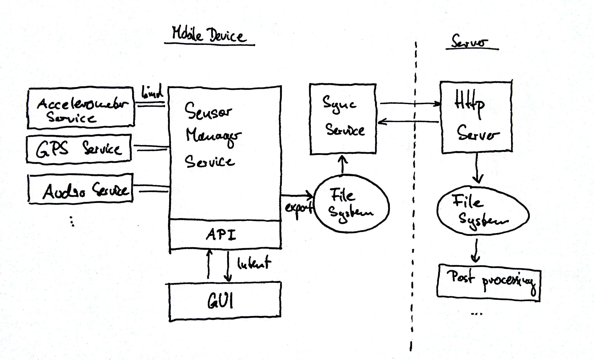

MobileSensing
=============

Android App for Sensor data collection.

The Mobile Sensing framework addresses the following tasks:

* Read data from various sensors
* Manage and control the recording of the sensors
* Write sensor data to local disk
* Sync data to a server system

Architecture Overview
=====================

The App constist of the following parts:

* Services for the individual sensors  
  * Records and caches values from individual sensors
* SensorManager Service
  * Binds sensor services
  * Listens to Intents fired by GUI
  * Runs in separate process/thread
* GUI
  * Get Start/Stop recording commands from user
  * Input Metadata
* SyncService (tbd.)
* HTTP-Server (tbd.)

See the [wiki](https://github.com/HeinrichHartmann/MobileSensing/wiki/_pages) for more details.
